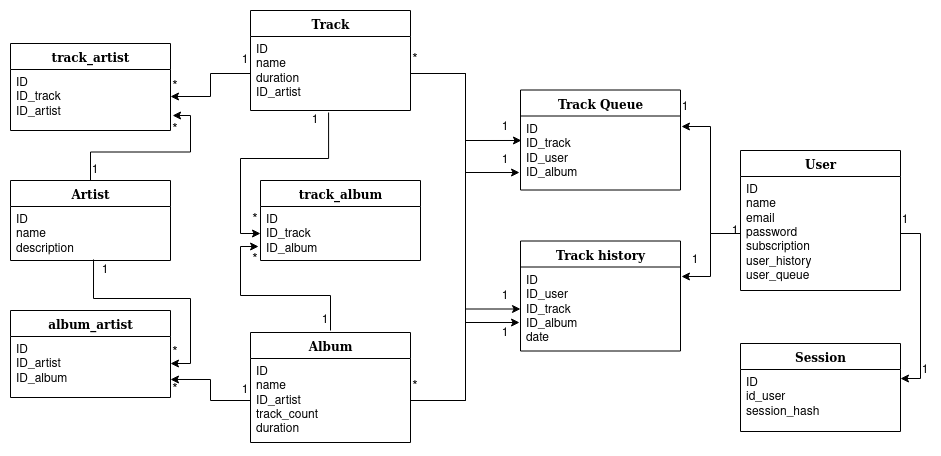

# Spotify

## Выбор темы
Цель РПЗ - спроектировать высоконагруженную систему, которая является аналогом Spotify.  
Основная функция - прослушивание музыки из альбомов исполнителей. 

## Оценка планируемого диапазона нагрузки
Месячный объем аудитории на территории России - [20 млн пользователей](https://vc.ru/flood/21426-ya-music-sub-2016) .  
Целевая аудитория - люди 16-40 лет, живущие в населенных пунктах, в которых есть возможность пользоваться интернетом.

## Расчет нагрузки
Основная нагрузка сервиса состоит в пересылке пользователю аудио файлов. 
Длительность большинства треков составляет 3-5 минут, возьмем среднее - 4 минуты. 
Самый высокий битрейт Spotify для бесплатной версии составляет [128 Кбит/с](https://support.spotify.com/md-ru/article/high-quality-streaming/),
а для платной - [320 Кбит/с](https://support.spotify.com/md-ru/article/high-quality-streaming/). 
Возьмем среднее арифметическое значение 240 Кбит/с.
Таким образом можно считать, что средний вес одной минуты песни составляет:  
```240 * 60 = 14400 Кбит ~ 1,8 Мб```  
Одна песня весит примерно 7 Мб.


Рассчитаем дневную нагрузку. Дневная аудитория ~3,6 млн пользователей.
В среднем люди тратят на прослушивание музыки около [90 минут](https://vc.ru/media/96460-chislo-podpischikov-yandeks-muzyki-vyroslo-v-tri-raza-za-poltora-goda-i-dostiglo-3-mln) в день. 
Тогда дневной трафик составляет:   
```3,6 * 10^6 * 90 * 1,8 = 556 Tб```

Медиатека Spotify составляет более [70 млн треков](https://newsroom.spotify.com/company-info/).
Будем считать, что каждая песня хранится в двух битрейтах для удобства отдачи 
в бесплатной и платной версиях. Расчитаем для каждого вес одной минуты песни: 
```128 * 60 = 7680 Кбит ~ 0,94 Мб```, ```320 * 60 = 19200 Кбит ~ 2,3 Мб```.  
Одна минута песни весит примерно ``(0,94 + 2,3) = 3,24 Мб ``, тогда целая песня ~ 13 Мб.  
Тогда минимальный объем хранилища для музыки составляет 
```70 * 10^6 * 13 = 868 Тб```

Выполним примерную оценку количества RPS для сервиса. 
За 90 минут пользователь прослушивает примерно 23 песни, пусть за каждой он совершает один запрос. 
Плюс в течение прослушивания на каждую песню совершается еще по два дополнительных запроса 
(переключение на следующую, поиск, открытие нового альбома и прочее). 
Предполагаемая нагрузка: 
``3,6 * 10^6 * 23 * 3 / 24 / 60 / 60 = 2875 rps``

## Логическая схема базы данных


