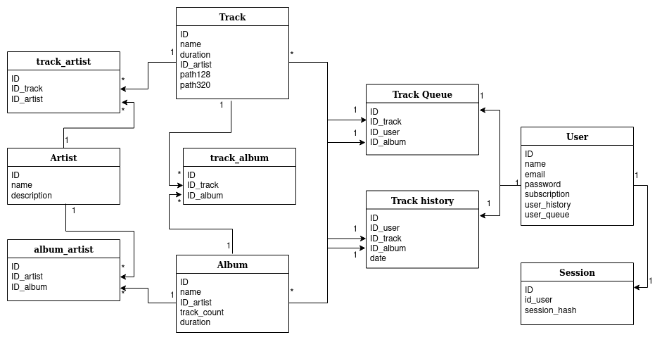
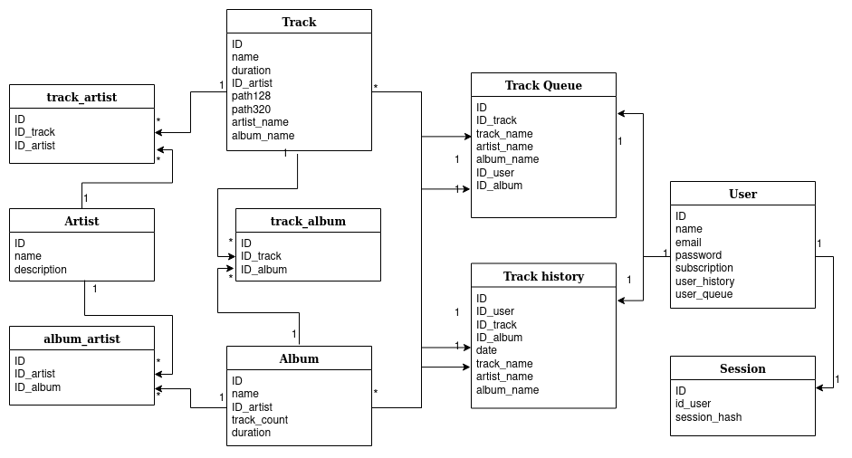

# Spotify

## Выбор темы
Цель РПЗ - спроектировать высоконагруженную систему, которая является аналогом Spotify.  
Основная функция - прослушивание музыки из альбомов исполнителей. 

## Оценка планируемого диапазона нагрузки
Месячный объем аудитории на территории России ~[12 млн пользователей](https://radar.yandex.ru/yandex?month=2020-11) .  
Целевая аудитория - люди 16-40 лет, живущие в населенных пунктах, в которых есть возможность пользоваться интернетом.

## Расчет нагрузки
Основная нагрузка сервиса состоит в пересылке пользователю аудио файлов. 
Длительность большинства треков составляет [3-5 минут](https://www.vox.com/2014/8/18/6003271/why-are-songs-3-minutes-long), 
возьмем среднее - 4 минуты. 
Самый высокий битрейт Spotify для бесплатной версии составляет [128 Кбит/с](https://support.spotify.com/md-ru/article/high-quality-streaming/),
а для платной - [320 Кбит/с](https://support.spotify.com/md-ru/article/high-quality-streaming/).
Таким образом можно считать, что средний вес одной минуты песни в высоком битрейте составляет:  
```320 * 60 = 19200 Кбит ~ 2,3 Мб``` Одна песня весит примерно 9,2 Мб.  
А в низком: ```128 * 60 = 7680 Кбит ~ 0,94 Мб``` Одна песня весит примерно 3,6 Мб. 

Согласно последнему [отчету Spotify](https://www.theverge.com/2021/2/3/22262508/spotify-q4-2020-earnings-subscriber-numbers-users-podcasts-audiobooks),
платную подписку имеют 155 млн из 345 млн пользователей в месяц. 
Возьмем ту же пропорцию для российской аудитории (0,4), тогда в среднем вес одной минуты песни составляет 
``2,3 * 0,4 + 0,94 * 0,6 = 1,5 Мб`` А для целой песни ~ 6Мб.

### Рассчитаем дневную нагрузку. 
Дневная аудитория ~[2 млн пользователей](https://radar.yandex.ru/yandex?month=2020-11).
В среднем люди тратят на прослушивание музыки около [90 минут](https://vc.ru/media/96460-chislo-podpischikov-yandeks-muzyki-vyroslo-v-tri-raza-za-poltora-goda-i-dostiglo-3-mln) в день. 
Тогда дневной трафик составляет:   
```2 * 10^6 * 90 * 1,5 = 258 Tб```.
Трафик загрузки трека:
``6 * 2 * 10^6 * 23 * 8 / 24 / 60 / 60 = 25Гбит/с``
Причем в пиковые часы нагрузка может возрастать [в два раза](https://habr.com/en/company/dcmiran/blog/496542/).


### Рассчитаем объем хранилища. 
Медиатека Spotify составляет более [70 млн треков](https://newsroom.spotify.com/company-info/).
Будем считать, что каждая песня хранится в двух битрейтах для удобства отдачи 
в бесплатной и платной версиях.  
Тогда минимальный объем хранилища для музыки составляет 
```70 * 10^6 * (9,2 + 3,6) = 868 Тб```

### Оценка RPS.
Выполним примерную оценку количества RPS для сервиса. 
За 90 минут пользователь прослушивает примерно 23 песни, пусть за каждой он совершает один запрос. 

Пусть сервис имеет только готовые плейлисты, 
тогда предполагаемый пользовательский сценарий заключается в выборе плейлиста и его включении. 
Чтобы это сделать необходимо 4 запроса: загрузить главную страницу со списком плейлистов и последнего прослушанного, загрузить данные пользователя,
загрузить конкретный плейлист. Во время прослушивания пользователь может поменять плейлист, например, через поиск, 
пусть это будет присходить 4 раза за одну сессию прослушивания.
Для этого необходимо еще 3 запроса: сам поиск, список найденый альбомов, загрузка конкретного альбома. 
Плюс пусть 5 раз за сессию совершается одно переключение на следующую песню.

Тогда предполагаемая нагрузка: 
``2 * 10^6 * (2 * 23 + 4 + 4 * 3 + 5) / 24 / 60 / 60 = 1551 rps``
При этом надо учитывать, что в пиковые часы нагрузка возрастает [в два раза](https://habr.com/en/company/dcmiran/blog/496542/).


Так же распишем некоторые основные запросы для навигации по контенту: 
* Загрузка списка плейлистов  
Одним ответом от сервера отдается около 30 поинтов, дальше в процессе пагинации, 
  подгружаются еще данные. Для сервера не важно совершает пользователь новый запрос или подгружает еще данные. 
  Пусть в целом за сессию совершается 4 таких запроса, тогда RPS: 
  ``2 * 10^6 * 4 / 24 / 60 / 60 = 92,6 rps``
* Загрузка плейлиста  
Загрузить весь плейлист можно одним запросом, за сессию пользователь пользователь тоже делает 4 запроса: 
  ``2 * 10^6 * 4 / 24 / 60 / 60 = 92,6 rps``
* Загрузка трека  
Для загрузки трека необходимо сделать запрос за самим треком и за информацией о нем. 
  По расчетам выше на сессию нужно 28 запросов: 
  ``2 * 10^6 * 2 * 28 / 24 / 60 / 60 = 648 rps``
* Поиск  
Поиск выполняется по тому же принципу, что и загрузка списка плейлистов:
  ``2 * 10^6 * 4 / 24 / 60 / 60 = 92,6 rps``


## Логическая схема базы данных


## Физическая схема базы данных

Денормализуем исходную схему БД, добавим в таблицы треков, очереди и истории дополнительные поля.



### Redis. 
Таблицы с сессиями и очерядями будут хранится в Redis.  
Redis – это хранилище данных типа «ключ‑значение», он хранит данные в памяти, что обеспечивает быстрое обращение к ним.
Для таблицы очередей для каждого пользователя будет хранится текущий альбом и текущая песня, 
тогда ежедневно необходимо:
``4(id) + 4(id_track) + 256(track_name) + 256(artist_name) + 256(album_name) + 4(id_user) + 4(id_album) = 784 байт``
``784 * 2 * 10^6 = 1495 Мб``

Сессии пользователя. ``3 * 16 * 2 * 10^6 = 92 Мб``  

В целом необходимо: ``1495 + 92 = 1587 Мб``. 

Для хранения данного объема информации достаточно одной базы + еще одна для реплекации. 

### Postgresql. 
Основные данные сервиса будут храниться в Postgresql. Выполним оценку объема данных для хранения.  

Пользователи:   
``4(id) + 256(name) + 256(email) + 512(password) + 1 (subscroption) + 4(user_history) + 4(user_queue) = 1037 байт``  
По данным росстата население Росси от 16 до 40 лет составляет 48 млн.    

Треки:   
``4(id) + 256(name) + 4(duration) + 4(id_artist) + 2*256(path) + 256(artist_name) + 256(album_name) = 1292 байт``  
70 млн в медиатеке  

Альбомы: ``4(id) + 256(name) + 4(duration) + 4(track_count) + 4(id_artist) = 272 байт``  
Среднее количество песен в музыкальном альбоме [12-14](https://ru.wikipedia.org/wiki/%D0%9C%D1%83%D0%B7%D1%8B%D0%BA%D0%B0%D0%BB%D1%8C%D0%BD%D1%8B%D0%B9_%D0%B0%D0%BB%D1%8C%D0%B1%D0%BE%D0%BC),
возьмем среднее - 13, тогда у нас будет примерно 5,4 млн альбомов.

Исполнители: ``4(id) + 256(name) + 1024(description) = 1284 байт``  
Пусть у каждого исполнителя будет по 5 альбов, тогда у нас всего 1,1 млн исполнителей.

История прослушивания. Будем хранить треки, прослушанные пользователем за посление сутки. 
``4(id) + 4(id_track) + 4(id_user) + 4(id_album) + 256(track_name) + 256(artist_name) + 256(album_name) + 4(date) = 788 байт``
``788 * 23 * 2 * 10^6 =  34568 Мб``  

Связь многие ко многим: ``3 * 4(id) = 12 байт``  

Итого: ``(1037 * 48 (пользователи) + 1292 * 70 (треки) + 272 * 5,4 (альбомы) + 1284 * 1,1 (исполнители) + 
788 * 23 (история) + 12 * (70 + 1,1 + 70)) * 10^6 = 
(49776 + 90440 + 1469 + 1412,4 + 18124 + 1693) * 10^6 = 152 Гб``


Чтобы отдавать данные за комфортное время и выдержать расчитанную нагрузку, база будет шардироваться
на 5 серверов по исполнителям с учетом статистики их статистики прослушивания. 
Каждый шард будет иметь по одной реплике которые будут работать в роли slave по отношению к основной базе.


### Audio. 
Для аудиофайлов понадобится дополнительные сервера, распределенные по России, например, 
в городах Москва, Санкт-Петербург, Новосибирск, Хабаровск. Будем считать, что пропускная способность 
состовляет около [10Гбит/с](https://aws.amazon.com/ec2/instance-types/), тогда пусть в каждом из городов
база с треками будет шардирована также по исполнителям. Пользователю будет отдаваться трек от ближайшего к нему сервера. 


## Выбор технологий
Для написания бекенда будет использован goland, как язык, с низким порогом входа, который хорошо зарекомендовал себя 
в разработке высоконагруженных приложений. При необходимости использования микросервисной архитектуры
(например, выделение сервисов авторизации и прослушивания альбома как основных функций), можно использовать 
фреймворк grpc.  
Для написания фронтенда можно использовать Java Script или Type Script, для упрощения 
работы будет использован React.  
В качестве балансировщика и реверс-прокси будет использован nginx.


